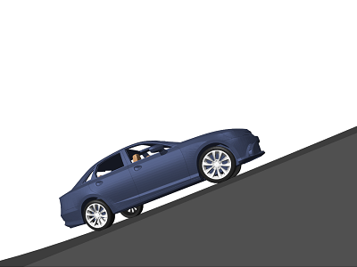

# Virtual Controls Laboratory 
 or   

**Curriculum Module**  
_Created with R2021a. Compatible with R2021a and later releases._  

## Description ##
The Virtual Controls Laboratory contains virtual models of several mechanisms commonly used in controls courses. These virtual mechanisms offer opportunities to visually analyze dynamic systems, identify system parameters, design and test controllers, among others. Instructions for four introductory labs are included. These labs are designed to give an intuitive introduction to basic controls concepts, such as feedback control. Students also have the opportunity to implement and test simple controllers in Simulink&reg;.

Get started with the Virtual Controls Laboratory by downloading and unzipping the repository. Then, double-click the project .prj file inside MATLAB&reg;. From there, you can follow the landing page instructions to get started with the labs and virtual mechanisms.

## Details ##

### Virtual Mechanisms ###
<table>
<tr>
    <td width=290>
        <b>Cruise control</b>
         <code>CruiseControl.slx</code>
        
    </td>
    <td width=290>
        <b>DC motor</b>
         <code>DCMotorControl.slx</code>
        
    </td>
    <td width=290>
        <b>Inverted pendulum</b>
         <code>InvertedPendulum.slx</code>
        
    </td>
</tr>
<tr>
    <td width=290>
        <b>Rotary pendulum</b>
         <code>RotaryPendulum.slx</code>
        
    </td>
    <td width=290>
        <b>Ball and beam</b>
         <code>BallAndBeam.slx</code>
        
    </td>
    <td width=290>
        <b>Ball and plate</b>
         <code>BallAndPlate.slx</code>
        
    </td>
</tr>
</table>

### Labs ###
**Lab 1: Cruise control `(Lab1_CruiseControl.mlx)`**  
A virtual lab that explores the basics of open-loop and feedback control. 

**Learning Goals:**
- Compare and contrast open-loop and feedback control.
- Implement a simple open-loop controller in Simulink.
- Analyze the performance of an open-loop controller.
- Implement a proportional controller in Simulink.
- Analyze the performance of a proportional controller.

## ##
**Lab 2: Vehicle Transfer Function Model `(Lab2_VehicleModel.mlx)`**  
In this lab, students derive a transfer function model of a virtual vehicle. 

**Learning Goals:**
- Derive the transfer function of a first order system.
- Compare the transfer function and virtual vehicle responses.
- Identify the model parameters for the virtual vehicle.

## ##
**Lab 3: Position Control `(Lab3_PositionControl.mlx)`**  
In this lab, students implement a PID controller to control the position of a virtual DC motor.

**Learning Goals:**
- Implement a PID controller.
- Identify rise time, settling time, overshoot, and peak time.
- Explain how changes to PID parameters affect the time-domain response.

## ##
**Lab 4: Position Control Analysis `(Lab4_PositionAnalysis.mlx)`**  
In this lab, students construct and analyze the closed-loop transfer function of a feedback controller.

**Learning Goals:**
- Construct a closed-loop transfer function.
- Plot the step response of a closed-loop transfer function.
- Identify the poles of a closed-loop transfer function.
- Assess the stability of a closed-loop transfer function.

## Suggested Prework ##
[MATLAB Onramp](https://matlabacademy.mathworks.com/details/matlab-onramp/gettingstarted) – a free two-hour introductory tutorial that teaches the essentials of MATLAB.
 
[Simulink Onramp](https://matlabacademy.mathworks.com/details/simulink-onramp/simulink) – a free three-hour introductory tutorial that teaches the essentials of Simulink.

## Products ##
MATLAB, Simulink, Control System Toolbox&trade;, Simscape&trade;, Simscape Multibody&trade;, Simscape Driveline&trade;

## License ##
The license for this module is available in the [LICENSE.md](license.md) file in this GitHub repository.

## Educator Resources ##
* [Featured Courseware](https://www.mathworks.com/academia/courseware/course-materials.html)
* [Teach with MATLAB and Simulink](https://www.mathworks.com/academia/educators.html)
* [MATLAB Grader](https://www.mathworks.com/products/matlab-grader.html)

The lab solutions are available upon instructor request. If you would like to request solutions or have a question, contact the <a href="mailto:onlineteaching@mathworks.com">MathWorks online teaching team.</a> If you are having technical issues using MATLAB, please contact our [Technical Support Team](https://www.mathworks.com/support/contact_us.html). 

# #

_Copyright 2023-2024 The MathWorks, Inc._
