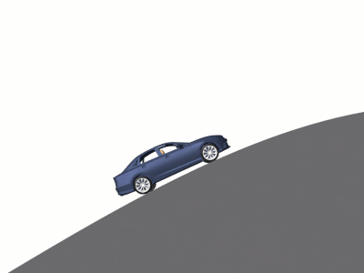
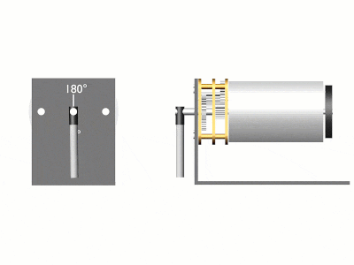
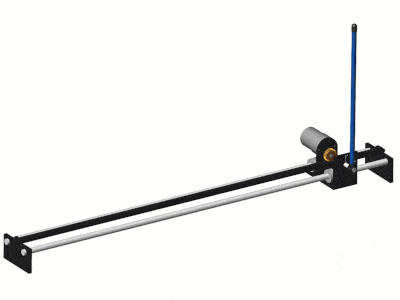
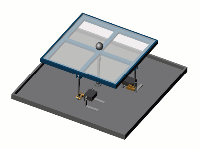

# Virtual Controls Laboratory 
 or   

**Curriculum Module**  
_Created with R2021a. Compatible with R2021a and later releases._  

## Description ##
The Virtual Controls Laboratory contains virtual models of several mechanisms commonly used in controls courses. These virtual mechanisms offer opportunities to visually analyze dynamic systems, identify system parameters, design and test controllers, among others. Instructions for four introductory labs are included. These labs are designed to give an intuitive introduction to basic controls concepts, such as feedback control. Students also have the opportunity to implement and test simple controllers in Simulink&reg;.

These modules connect the theory and application of the specific subject, which will support various student learning objectives. These lessons can be used as part of a lecture to supplement learning, as activities in an instructional setting, or as interactive assignments to be completed outside class.

## Get started with the Virtual Controls Laboratory interactive examples ##

**Option 1: Download to Desktop** Download and unzip the repository. Then, double-click the VirtualControlsLabortory.prj file inside MATLAB&reg;. If you open a script or model and MATLAB notifies you that a certain toolbox is not installed, click the arrow on the  **Add-Ons** button in the **ENVIRONMENT** section on the **HOME** tab in the MATLAB Toolstrip. Then, navigate to **Manage Add-ons** to install the necessary toolboxes. 

**Option 2: [Open in MATLAB Online](https://matlab.mathworks.com/open/github/v1?repo=MathWorks-Teaching-Resources/Virtual-Controls-Laboratory&project=VirtualControlsLabortory.prj)** Log in to your MathWorks account to access your license. If you are associated with a university, use your university email to access a license.

- From there, you can follow the landing page instructions to get started with the examples. 
- The instructions inside the live scripts will guide you through the exercises and activities. 
- Get started with each live script by running it one section at a time. 
- To stop running the script or a section midway (for example, if a loop is running longer than intended), click the  **Stop** button in the **RUN** section of the **Live Editor** tab in the MATLAB Toolstrip.

## Prerequisite Domain Knowledge ##
These scripts assume some familiarity with open/closed loop feedback control, deriving transfer functions, PID controllers, and stability control (poles and zeros). It is possible to work through this module without extensive experience in MATLAB and Simulink. However, some background in these products will be helpful. Please see the suggested pre-work section below for self-paced tutorials that can support quicker onboarding.

## Details ##

### Virtual Mechanisms ###
<table>
<tr>
    <td width=290>
        <b>Cruise control</b>
         <code>CruiseControl.slx</code>
        
    </td>
    <td width=290>
        <b>DC motor</b>
         <code>DCMotorControl.slx</code>
        
    </td>
    <td width=290>
        <b>Inverted pendulum</b>
         <code>InvertedPendulum.slx</code>
        
    </td>
</tr>
<tr>
    <td width=290>
        <b>Rotary pendulum</b>
         <code>RotaryPendulum.slx</code>
        
    </td>
    <td width=290>
        <b>Ball and beam</b>
         <code>BallAndBeam.slx</code>
        
    </td>
    <td width=290>
        <b>Ball and plate</b>
         <code>BallAndPlate.slx</code>
        
    </td>
</tr>
</table>

### Labs ###
**Lab 1: Cruise control `(Lab1_CruiseControl.mlx)`**  
A virtual lab that explores the basics of open-loop and feedback control. 

**Learning Goals:**
- Compare and contrast open-loop and feedback control.
- Implement a simple open-loop controller in Simulink.
- Analyze the performance of an open-loop controller.
- Implement a proportional controller in Simulink.
- Analyze the performance of a proportional controller.

## ##
**Lab 2: Vehicle Transfer Function Model `(Lab2_VehicleModel.mlx)`**  
In this lab, students derive a transfer function model of a virtual vehicle. 

**Learning Goals:**
- Derive the transfer function of a first order system.
- Compare the transfer function and virtual vehicle responses.
- Identify the model parameters for the virtual vehicle.

## ##
**Lab 3: Position Control `(Lab3_PositionControl.mlx)`**  
In this lab, students implement a PID controller to control the position of a virtual DC motor.

**Learning Goals:**
- Implement a PID controller.
- Identify rise time, settling time, overshoot, and peak time.
- Explain how changes to PID parameters affect the time-domain response.

## ##
**Lab 4: Position Control Analysis `(Lab4_PositionAnalysis.mlx)`**  
In this lab, students construct and analyze the closed-loop transfer function of a feedback controller.

**Learning Goals:**
- Construct a closed-loop transfer function.
- Plot the step response of a closed-loop transfer function.
- Identify the poles of a closed-loop transfer function.
- Assess the stability of a closed-loop transfer function.

## Suggested Prework ##
The suggested prework detailed below are complementary interactive online courses available for all to use with a valid MathWorks account.

* [MATLAB Onramp](https://matlabacademy.mathworks.com/details/matlab-onramp/gettingstarted) – a free two-hour introductory tutorial that teaches the basics of programming in MATLAB.
* [Simulink Onramp](https://matlabacademy.mathworks.com/details/simulink-onramp/simulink) – a free two-hour introductory tutorial that teaches the basics of simulating mathematical models in Simulink.
* [Control Design Onramp with Simulink](https://matlabacademy.mathworks.com/details/control-design-onramp-with-simulink/controls) - a free one-hour introductory tutorial that teaches the basics of control design in Simulink.

## Products ##
MATLAB, Simulink, Control System Toolbox&trade;, Simscape&trade;, Simscape Multibody&trade;, Simscape Driveline&trade;

## License ##
The license for this module is available in the [LICENSE.md](license.md) file in this GitHub repository.

## Educator Resources ##
* [Transfer Function Analysis of Dynamics Systems Courseware](https://www.mathworks.com/matlabcentral/fileexchange/94635-transfer-function-analysis-of-dynamic-systems?s_tid=srchtitle)
* [Featured Courseware](https://www.mathworks.com/academia/courseware/course-materials.html)
* [Resources for Educators](https://www.mathworks.com/academia/educators.html)

The lab solutions are available upon instructor request. If you would like to request solutions or have a question, contact the <a href="mailto:onlineteaching@mathworks.com">MathWorks online teaching team.</a> If you are having technical issues using MATLAB, please contact our [Technical Support Team](https://www.mathworks.com/support/contact_us.html). 

# #

_Copyright 2023-2024 The MathWorks, Inc._
