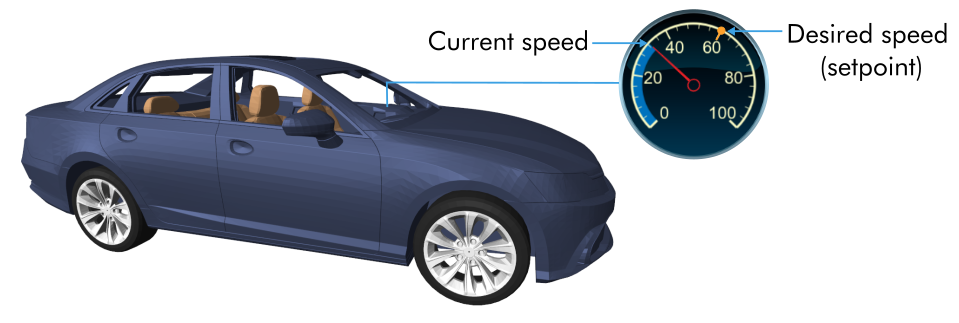
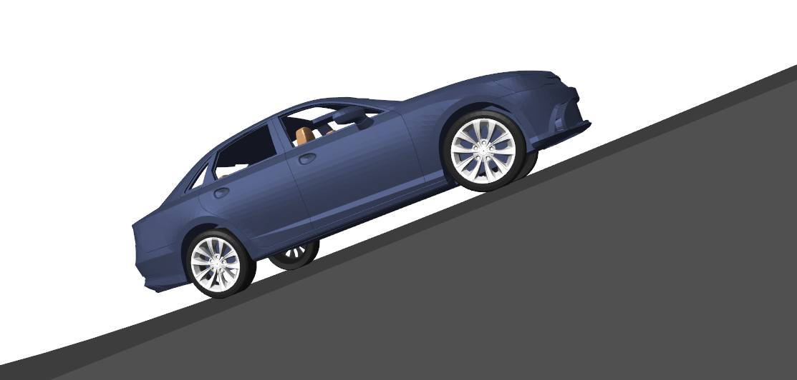
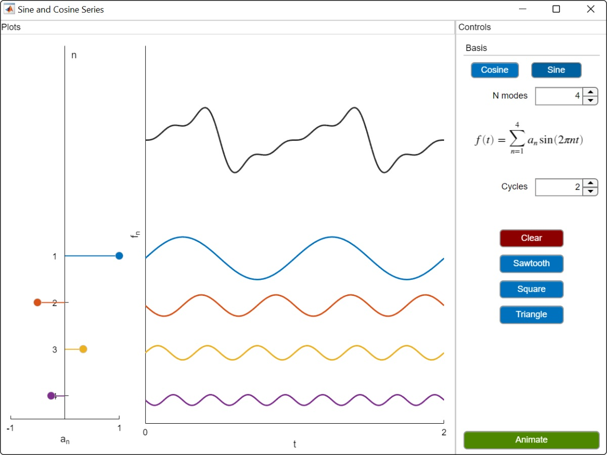

# Virtual Controls Laboratory

 or 

**Curriculum Module**

_Created with R2021a. Compatible with R2021a and later releases._

# Information

This curriculum module contains interactive [MATLAB® live scripts](https://www.mathworks.com/products/matlab/live-editor.html) and [Simulink](https://www.mathworks.com/products/simulink.html) models that teaches common concepts used in controls courses.

## Background

You can use these live scripts as demonstrations in lectures, class activities, or interactive assignments outside class. These virtual labs offer opportunities to visually analyze dynamic systems, identify system parameters, design and test controllers, among others. Instructions for four introductory labs are included. These labs are designed to give an intuitive introduction to basic controls concepts, such as feedback control. Students also have the opportunity to implement and test simple controllers in Simulink.

The instructions inside the live scripts will guide you through the exercises and activities. Get started with each live script by running it one section at a time. To stop running the script or a section midway (for example, when an animation is in progress), use the  Stop button in the **RUN** section of the **Live Editor** tab in the MATLAB Toolstrip.

## Contact Us

Solutions are available upon instructor request. Contact the [MathWorks teaching resources team](mailto:onlineteaching@mathworks.com) if you would like to request solutions, provide feedback, or if you have a question.

## Prerequisites

This module assumes basic knowledge of algebra, differential equations and control system theory. There is minimal MATLAB knowledge required for these scripts and app, but you could use [MATLAB Onramp](https://matlabacademy.mathworks.com/details/matlab-onramp/gettingstarted), [Simulink Onramp](https://matlabacademy.mathworks.com/details/simulink-onramp/simulink) and [Control Design Onramp with Simulink](https://matlabacademy.mathworks.com/details/control-design-onramp-with-simulink/controls) as resources to acquire familiarity with MATLAB syntax, live scripts, and Simulink models and controls.

## Getting Started
### Accessing the Module
### **On MATLAB Online:**

Use the  link to download the module. You will be prompted to log in or create a MathWorks account. The project will be loaded, and you will see an app with several navigation options to get you started.

### **On Desktop:**

Download or clone this repository. Open MATLAB, navigate to the folder containing these scripts and double-click on [VirtualControlsLaboratory.prj](https://matlab.mathworks.com/open/github/v1?repo=MathWorks-Teaching-Resources/Virtual-Controls-Laboratory&project=VirtualControlsLaboratory.prj). It will add the appropriate files to your MATLAB path and open an app that asks you where you would like to start. 

Ensure you have all the required products ([listed below](#H_E850B4FF)) installed. If you need to include a product, add it using the Add-On Explorer. To install an add-on, go to the **Home** tab and select   **Add-Ons** > **Get Add-Ons**. 

## Products

 *MATLAB* is used throughout. Tools from *Simulink*, *Control System Toolbox™, Simscape™, Simscape Multibody™, and Simscape Driveline™* are used frequently as well.

# Scripts

 *If you are viewing this in a version of MATLAB prior to R2023b, you can view the learning outcomes for each script* [*here*](https://www.mathworks.com/matlabcentral/fileexchange/100064-virtual-hardware-and-labs-for-controls)

## [**CruiseControl.mlx**](https://matlab.mathworks.com/open/github/v1?repo=MathWorks-Teaching-Resources/Virtual-Controls-Laboratory&project=VirtualControlsLaboratory.prj&file=CruiseControl.mlx)
|  | **In this script, students will...** | **Academic disciplines**  |
| :-- | :-- | :-- |
|  |  • Compare and contrast open-loop and feedback control. • Implement a simple open-loop controller in Simulink. • Analyze the performance of an open-loop controller. • Implement a proportional controller in Simulink. • Analyze the performance of a proportional controller. | • Mechanical Engineering • Electrical Engineering • Mathematics  |

## [**VehicleModel.mlx**](https://matlab.mathworks.com/open/github/v1?repo=MathWorks-Teaching-Resources/Virtual-Controls-Laboratory&project=VirtualControlsLaboratory.prj&file=VehicleModel.mlx)
|  | **In this script, students will...** | **Academic disciplines**  |
| :-- | :-- | :-- |
|  |  • Derive the transfer function of a first order system. • Compare the transfer function and virtual vehicle responses. • Identify the model parameters for the virtual vehicle. | • Mechanical Engineering • Electrical Engineering • Mathematics  |

## [**PositionControl.mlx**](https://matlab.mathworks.com/open/github/v1?repo=MathWorks-Teaching-Resources/Virtual-Controls-Laboratory&project=VirtualControlsLaboratory.prj&file=PositionControl.mlx)
|  | **In this script, students will...** | **Academic disciplines**  |
| :-- | :-- | :-- |
|  |  • Implement a PID controller. • Identify rise time, settling time, overshoot, and peak time. • Explain how changes to PID parameters affect the time-domain response. | • Mechanical Engineering • Electrical Engineering • Mathematics  |

## [**PositionAnalysis.mlx**](https://matlab.mathworks.com/open/github/v1?repo=MathWorks-Teaching-Resources/Virtual-Controls-Laboratory&project=VirtualControlsLaboratory.prj&file=PositionAnalysis.mlx)
|  | **In this script, students will...** | **Academic disciplines**  |
| :-- | :-- | :-- |
|  |  • Construct a closed-loop transfer function. • Plot the step response of a closed-loop transfer function. • Identify the poles of a closed-loop transfer function. • Assess the stability of a closed-loop transfer function. | • Mechanical Engineering • Electrical Engineering • Mathematics  |

# Virtual Labs

Virtual labs is the idea of taking hardware and converting it into a realistic computer simulation. This allows the user to expand their intuition and test beyond the capabilities of the hardware. Below is a set of virtual mechanisms available in this module to explore:

| [**CruiseControl.slx**](https://matlab.mathworks.com/open/github/v1?repo=MathWorks-Teaching-Resources/Virtual-Controls-Laboratory&project=VirtualControlsLaboratory.prj&file=CruiseControl.slx) | [**DCMotorControl.slx**](https://matlab.mathworks.com/open/github/v1?repo=MathWorks-Teaching-Resources/Virtual-Controls-Laboratory&project=VirtualControlsLaboratory.prj&file=DCMotorControl.slx) | [**InvertedPendulum.slx**](https://matlab.mathworks.com/open/github/v1?repo=MathWorks-Teaching-Resources/Virtual-Controls-Laboratory&project=VirtualControlsLaboratory.prj&file=InvertedPendulum.slx)  |
| :-- | :-- | :-- |
|  |  |   |
| [**RotaryPendulum.slx**](https://matlab.mathworks.com/open/github/v1?repo=MathWorks-Teaching-Resources/Virtual-Controls-Laboratory&project=VirtualControlsLaboratory.prj&file=RotaryPendulum.slx) | [**BallAndBeam.slx**](https://matlab.mathworks.com/open/github/v1?repo=MathWorks-Teaching-Resources/Virtual-Controls-Laboratory&project=VirtualControlsLaboratory.prj&file=BallAndBeam.slx) | [**BallAndPlate.slx**](https://matlab.mathworks.com/open/github/v1?repo=MathWorks-Teaching-Resources/Virtual-Controls-Laboratory&project=VirtualControlsLaboratory.prj&file=BallAndPlate.slx)  |
|  |  |   |

# License

The license for this module is available in the [LICENSE.md](https://github.com/MathWorks-Teaching-Resources/Virtual-Controls-Laboratory/blob/release/LICENSE.md).

# Related Courseware Modules

## [Fourier Analysis](https://www.mathworks.com/matlabcentral/fileexchange/106725-fourier-analysis?s_tid=srchtitle)
|  | **Available on:**     [GitHub](https://github.com/MathWorks-Teaching-Resources/Fourier-Analysis)   |
| :-- | :-- |

## [Transfer Function Analysis of Dynamic Systems](https://www.mathworks.com/matlabcentral/fileexchange/94635-transfer-function-analysis-of-dynamic-systems?s_tid=srchtitle)
|  | **Available on:**     [GitHub](https://github.com/MathWorks-Teaching-Resources/Transfer-Function-Analysis-of-Dynamic-Systems)  |
| :-- | :-- |

Feel free to explore our other [modular courseware content](https://www.mathworks.com/matlabcentral/fileexchange/?q=tag%3A%22courseware+module%22&sort=downloads_desc_30d).

# Educator Resources
-  [Educator Page](https://www.mathworks.com/academia/educators.html) 

# [README](README.mlx)

# Contribute 

Looking for more? Find an issue? Have a suggestion? Please contact the [MathWorks teaching resources team](mailto:%20onlineteaching@mathworks.com). If you want to contribute directly to this project, you can find information about how to do so in the [CONTRIBUTING.md](https://github.com/MathWorks-Teaching-Resources/Virtual-Controls-Laboratory/blob/release/CONTRIBUTING.md) page on GitHub.

 *©* Copyright 2023 The MathWorks™, Inc

